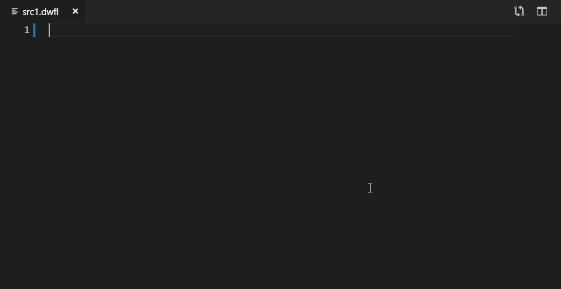
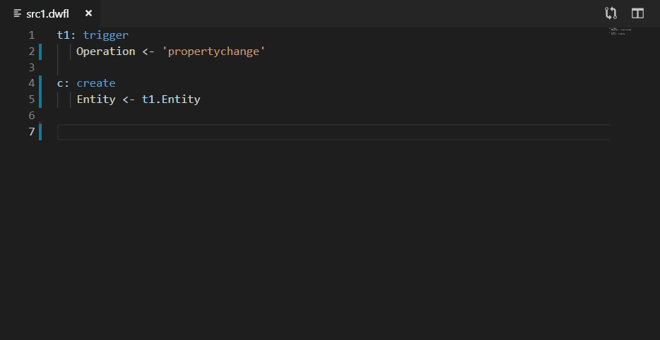

# Dynamo Workflow Logic Language

This extenstion supports [Dinamo Software](https://www.dynamosoftware.com/) domain specific language - Workflow Language.

Supports files with extension "DWFL".

## Features

Intellisense for operation types and well-known input arguments:

Check for valid operation types and operation names:

## Extension Settings

This extension contributes the following settings:

* `dynamoWorkflowLanguageServer.maxNumberOfProblems`: Controls the maximum number of problems produced by the server

## Known Issues

A lot of functionality is yet to be implemented! If you desperately need some helpful feature, or need a bug to be eradicate, please file an issue at [gitgub](https://github.com/m1rr0r/dynamo-wfl/issues).

## Release Notes

### 0.0.1

Initial release